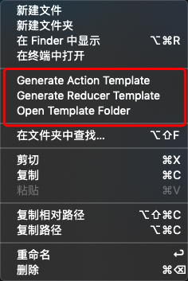
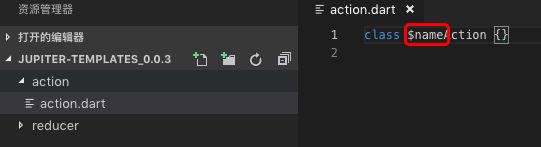
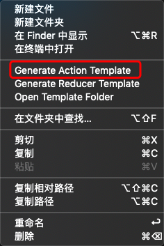
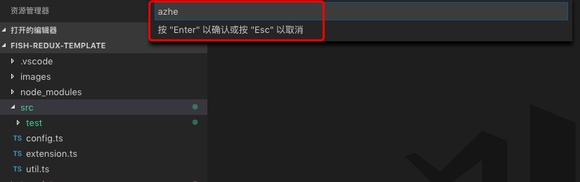
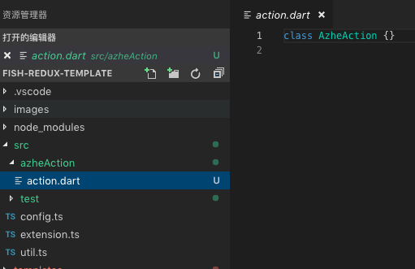

## 创建 redux 相关模板

### 使用

#### 1. 打开模版文件夹(open template folder)

#### 2. 修改模版文件,可以在对应文件夹下添加或删除文件。文件中的`$name`将被创建时输入的名称所替换(首字母自动转为大写)。修改完成并保存退出。

#### 3. 相关文件夹下创建相关模板(如action模板),并输入名称

#### 4. 创建完成

